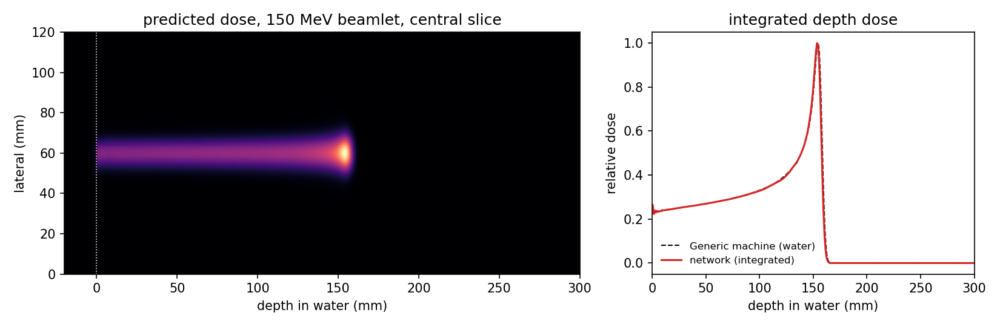
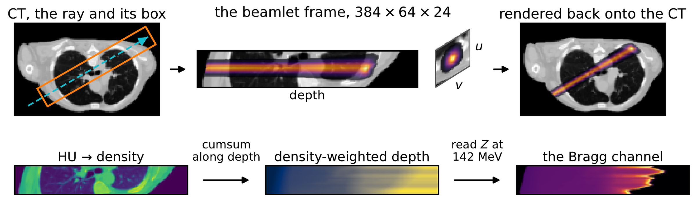

# DoseRAD2026 Task 3: proton dose in the beamlet frame

[](https://github.com/maximfyn/beamlet-frame-proton-dose/actions/workflows/tests.yml)
[](LICENSE)
[](https://doserad2026.grand-challenge.org/evaluation/final-testing-proton-dose-on-ct/leaderboard/)

An entry to Task 3 (proton dose on CT) of the
[DoseRAD2026 challenge](https://doserad2026.grand-challenge.org/) at MICCAI 2026.
It predicts proton pencil-beam dose on CT one beamlet at a time: each beamlet is
resampled into a box aligned with its own ray, predicted there by a factorised 3D
U-Net, and rendered back onto the CT. The predicted beamlets can then be used for
fast radiotherapy treatment planning, e.g. with
[pyRadPlan](https://github.com/e0404/pyRadPlan).



*One 150 MeV beamlet in a water phantom, predicted on a laptop CPU in a few seconds.
Its integrated depth dose (red) tracks the Generic machine's water curve (dashed) — the
same curve the network's Bragg input is built from — with the peak 1.1 mm shallower. A
consistency check in a geometry the network never saw, not an independent accuracy test.
Reproduce with `python examples/water_phantom.py`.*

## Results

DoseRAD2026 final test, Task 3, 40 patients ([leaderboard](https://doserad2026.grand-challenge.org/evaluation/final-testing-proton-dose-on-ct/leaderboard/)):

| beam MAE ↓ | IDD distance ↓ | plan MAE ↓ | gamma 1%/1 mm ↑ | DVH score ↓ | runtime ↓ |
|---|---|---|---|---|---|
| 0.0065 ± 0.0017 | 0.0030 ± 0.0014 | 0.0054 ± 0.0016 | 97.65 ± 2.31 | 0.376 ± 0.303 | 17.64 s |
| 5th | 3rd | 3rd | 3rd | 4th | 2nd |

Overall 3rd after the runtime tie-break (mean position 3.1; runtime counts
twice). ± is the between-patient standard deviation.

### Speed and training cost

| | hardware | time |
|---|---|---|
| training, base (240 epochs, all 75 patients) | 2 × NVIDIA H200 | **49.1 h** |
| training, fine-tune (3 epochs, 61 patients) | 2 × NVIDIA H200 | **0.6 h** |
| inference, final test (1 CT, 500 dose maps, challenge fit) | NVIDIA A10G (AWS `g5.2xlarge`) | **17.64 s** (≈35 ms per dose map) |
| inference, forward pass alone (compiled, measured in the shipped image on real inputs) | NVIDIA A10G | 23.2 ms per beamlet |
| one beamlet, water phantom | laptop CPU (Apple M1 Pro) | 3–6 s |

## Method



*Top: one beamlet on its CT slice, in its own frame (the network's view), and rendered
back onto the CT, which is what is scored. Bottom: how the Bragg-prior input channel
is built along the ray.*

- **Beamlet frame.** Each beamlet is resampled into a 384 × 64 × 24 box at
  (1, 1, 3) mm, aligned with its ray and anchored where the box first reaches the
  body (`models/geometry.py`). Three input channels: CT (HU), the beamlet energy,
  and an analytic Bragg depth-dose prior (`models/physics.py`).
- **Factorised head.** A 5-level 3D U-Net (53.26 M parameters) feeds two branches:
  an integrated depth-dose curve `IDD(d)` and a lateral kernel `k(u,v | d)` that a
  softmax normalises to unit mass at every depth. Dose is their product, so the
  scored depth-dose curve is an explicit output and zeros beyond the distal
  fall-off are exact (`models/network.py`).
- **Pre-compensated labels.** Resampling into the box and rendering back is not the
  identity: the naively resampled label alone would score a beam MAE of ~0.01, worse
  than the model. Labels are therefore solved offline by projected Landweber
  iteration (32 steps) for the box array whose render reproduces the truth, which
  cuts that floor by 85% (`scripts/data/preprocess_beamlets.py`).
- **Loss.** Dose-weighted MSE + 0.05 × beamlet-frame IDD distance; the submitted
  model adds three warm-start epochs under a rendered-frame bias term
  (`scripts/train/train_doserad.py`).

Full details are in the [method description](docs/method_description.pdf).

## Quick start (CPU, no dataset needed)

```bash
# on Linux, add --extra-index-url https://download.pytorch.org/whl/cpu to skip the CUDA wheel
pip install -r requirements.txt matplotlib
mkdir -p checkpoints
curl -L -o checkpoints/tall24_it32_rbias_w32_ep002.pt \
    https://github.com/maximfyn/beamlet-frame-proton-dose/releases/download/v1.0/tall24_it32_rbias_w32_ep002.pt
python examples/water_phantom.py            # writes water_phantom.png
```

## Predict on your own CT

The model is three calls: load it, describe your CT grid and beamlets, predict.

- **The CT grid** (`VolumeGeometry`): where voxel [0, 0, 0] sits in world
  millimetres and the voxel size, so each beamlet's ray can be placed in the CT.
- **A beamlet** (`BeamletRequest`): two points in world millimetres that define
  its ray, and its energy.
- **`predict`** returns one dose volume per beamlet, as a numpy array on the CT's
  own grid. Per-image work is cached on the CT array object, so pass a new array
  rather than editing one in place between calls.

```python
import numpy as np
from models.geometry import VolumeGeometry
from models.predictor import BeamletRequest, DosePredictor

predictor = DosePredictor.from_checkpoint(
    "checkpoints/tall24_it32_rbias_w32_ep002.pt", device="cuda")   # or "cpu"

ct = ...  # CT in HU, numpy array in (z, y, x) order
geom = VolumeGeometry(origin=np.array([ox, oy, oz]),     # world mm of voxel [0, 0, 0], (x, y, z)
                      spacing=np.array([sx, sy, sz]),    # mm, (x, y, z)
                      shape=ct.shape)
beamlet = BeamletRequest(ray_source=(x0, y0, z0), ray_target=(x1, y1, z1),  # world mm
                         energy=150.35,                   # MeV
                         output_file_idx=0, idx_in_output=0,  # challenge output bookkeeping: leave at 0
                         minimum_cutoff=0.0)              # 0 = no dose threshold
(dose,) = predictor.predict(ct, geom, [beamlet])
```

If your CT is a SimpleITK image, build the grid with `VolumeGeometry.from_sitk(image)`,
which also checks the image orientation; the manual form above assumes an
identity direction matrix. As in the DoseRAD2026 data, rays must lie in the axial
plane: the unit ray direction may have a *z* component of at most 1e-9, so give both
endpoints the same *z*. A ray outside that tolerance returns an all-zero volume and
prints a line, rather than raising. `DosePredictor` defaults to `snap_alpha=0.0`, what the submitted
container ran: dose below `minimum_cutoff` is zeroed rather than lifted up to it
(and with `minimum_cutoff=0` the setting does nothing either way). Energies should be
among the Generic proton machine's 114 (the dataset's 85 all are), because the Bragg
prior is read from that machine's depth-dose table. Any other energy uses the nearest
curve, with a printed warning if it is more than 0.01 MeV away.
`examples/water_phantom.py` is a complete, runnable version on a synthetic CT.

## Weights

Attached to the [v1.0 release](https://github.com/maximfyn/beamlet-frame-proton-dose/releases/tag/v1.0) (53,259,786 parameters each).

| file | what it is | epoch / step | sha256 |
|---|---|---|---|
| `tall24_it32_rbias_w32_ep002.pt` | **the submitted model** | 2 / 4,941 | `76f9f96a5c33659ccfaa9b040767055f4f37806689189d4d49c296ccf5a8c440` |
| `e240_FINAL.pt` | the base model it was fine-tuned from (best epoch of 240) | 229 / 465,750 | `cacca6a63bbfdb7d86f808c2e7f7572e3e9e9f458fda2b9172240837d1eebbd5` |

Both are the exact files that were trained and scored; their metadata still
records the paths of the machine that trained them. They are for non-commercial
research use (see [License](#license)).

```bash
shasum -a 256 checkpoints/*.pt   # check against the table
```

## Limitations and open directions

- **Network size was never ablated.** Width was never varied and depth only once,
  early, as a 4-versus-5-level comparison — while the other leading Task 3 entries
  report 0.7–6.5 M parameters in their method descriptions (public on the final
  leaderboard), against its 53 M. The
  forward pass dominates inference time, so a size sweep is the most direct route to
  a faster model at the same accuracy.
- **Scope.** Trained on 75 thorax and abdomen CTs, one beam model (matRad's Generic
  machine) and the dataset's 36-angle plans. Untested on other sites, other beam
  models or non-axial beams.
- **Generalisation gap.** A development version (61 training patients, 120 epochs,
  a box 16 rather than 24 voxels in *v*) scores 20% worse beam MAE on the 14
  patients it did not train on (6 of them used for checkpoint selection) than on
  its own training patients.
- **Regularisation at full scale.** Flip augmentation, weight decay and an EMA of the
  weights halved the generalisation gap in a shorter run, but were never trained at
  the submitted budget.
- **Explicit range inputs.** The remaining range to the Bragg peak, which the prior
  encodes only implicitly.
- **Train where the dose is judged.** Gamma and DVH-based metrics are evaluated on the
  composed plan in the patient's CT frame, while this model's loss is computed per
  beamlet in the beamlet frame. Plan-level behaviour could not be measured during
  development: composing and scoring plans needs beamlet weights and structure
  contours that the dataset does not include. Most other leading entries computed
  their loss on the patient grid, by their method descriptions (linked from the
  [final leaderboard](https://doserad2026.grand-challenge.org/evaluation/final-testing-proton-dose-on-ct/leaderboard/)). Here the render onto the CT grid is already
  differentiable (the fine-tuning term uses it), so a CT-frame loss is a direct next
  step.

## Repository layout

| path | contents |
|---|---|
| `models/` | geometry (frame, resampling, render), Bragg prior, network, dataset reader, inference predictor, AOTI loader |
| `scripts/data/preprocess_beamlets.py` | raw CT + MC dose → memory-mapped beamlet-frame shards with pre-compensated labels |
| `scripts/checkpoint_build_args.py` | the Docker labels for a checkpoint: step, epoch, geometry hash |
| `scripts/data/export_bragg_table.py` | rebuilds or checks `models/bragg_generic.npz` from pyRadPlan's Generic machine and the dataset's HU table |
| `scripts/train/train_doserad.py` | trainer (DDP, bf16, one-cycle) |
| `configs/` | `base_e240.yaml`, `finetune_rbias_w32.yaml` — the two runs behind the submitted model |
| `submission/` | the Grand Challenge container: `Dockerfile`, `app.py` (invoke API), `inference.py`, AOTI export |
| `examples/` | `water_phantom.py` — the model as a library, on CPU |
| `evaluation/metrics.py` | local beam MAE / IDD, held to the challenge's released evaluation code (tests run with a clone of `github.com/DoseRAD2026/evaluation-setup` at `external/evaluation-setup`) |
| `tests/` | CPU tests for geometry, network, losses, predictor and writer (GPU/data tests skip) |

## Reproduce

The inference path here is the code that ran in the scored container. The
training code has been edited since, including fixes that change behaviour, so a
rerun writes a checkpoint carrying more fields than the released ones. The two
configs reproduce every hyperparameter recorded inside the released checkpoints,
including the base run's 75-patient list in order; what differs is bookkeeping —
run names, paths, and the logging flag. No random seed is set, so a retrain lands
within the rerun-to-rerun spread (~1.2% beam MAE), not on identical weights. Built from this
README on an NVIDIA A10G, the step 5 container and the step 6 image with compiled
kernels both reproduced the `.mha` volumes the platform returned to us, byte for byte; on CPU, to a mean 4 × 10⁻⁶ of each beamlet's
peak. Those volumes are our own submission's outputs and are not ours to redistribute,
so this is a statement of what we checked, not something a reader can re-run. Level 2 metrics and the paper's held-out numbers can't be recomputed here — they
need beamlet weights, structure masks and a development checkpoint that aren't
distributed — but `evaluation/metrics.py` gives beam MAE and IDD distance for any
predicted dose map and its ground truth.

### 1. Environment

Python 3.12 (as in CI and training):

```bash
python -m venv .venv && source .venv/bin/activate
pip install -r requirements.txt
python -m pytest tests -q          # CPU: ~330 pass, GPU/data tests skip
```

### 2. Data

The DoseRAD2026 proton training release. Its persistent DOI is on
[Zenodo](https://doi.org/10.5281/zenodo.19347848), whose page links the Hugging Face
download (864 GB for all tasks). Place it as

```
data/dataset_raw/proton/training/
    beam_parameters.json
    <PID>/<PID>.json   <PID>/image/ct.mha   <PID>/dose/Dose_*.mha      (75 patients)
```

### 3. Preprocess

Each beamlet is resampled into a 384 × 64 × 24 voxel box (depth × two lateral axes,
see [Method](#method)). The preprocessor defaults to 16 voxels in the last axis, hence
`--n-lat-v 24`; `--iterations 32` sets the Landweber iterations. The base model trains
on all 75 patients, so build all three splits:

```bash
python scripts/data/preprocess_beamlets.py \
    --raw-root data/dataset_raw/proton/training \
    --out-root data/dataset_beamlet_tall24_it32/proton \
    --splits train val test --n-lat-v 24 --iterations 32 \
    --gpus 0 --workers 8
DOSERAD_BEAMLET_ROOT=data/dataset_beamlet_tall24_it32/proton \
    python -m pytest tests/test_dataset_contract.py -q \
    --deselect tests/test_dataset_contract.py::test_test_patients_are_never_preprocessed
```

Budget about 190 GB for the shards (81,000 beamlets × 384 × 64 × 24 voxels, int16
CT plus float16 label) and several hours on one GPU.

The contract test accepts or rejects the shards. The one deselected check guards the
development split (the 8 held-out patients are never preprocessed); the base model
deliberately trains on all 75, so here it would fail by design.

### 4. Train

```bash
# base: 240 epochs, 2 GPUs × batch 20 = effective 40
python -m torch.distributed.run --nproc_per_node=2 scripts/train/train_doserad.py \
    --config configs/base_e240.yaml --data-root data/dataset_beamlet_tall24_it32/proton

# fine-tune: 3 epochs from the base; the submitted model is the last epoch (ep002)
cp checkpoints/base_e240_best.pt checkpoints/e240_FINAL.pt      # or the released file
python -m torch.distributed.run --nproc_per_node=2 scripts/train/train_doserad.py \
    --config configs/finetune_rbias_w32.yaml --data-root data/dataset_beamlet_tall24_it32/proton
```

Some multi-GPU nodes need `NCCL_NVLS_ENABLE=0`.

### 5. Build and run the container

```bash
mkdir -p model && cp checkpoints/tall24_it32_rbias_w32_ep002.pt model/checkpoint.pt
# retrained yourself? step 4 writes checkpoints/finetune_rbias_w32_ep002.pt instead
docker build -f submission/Dockerfile -t doserad2026-task3 \
    --build-arg GIT_SHA=$(git rev-parse --short HEAD) \
    $(python scripts/checkpoint_build_args.py model/checkpoint.pt) .   # step, epoch, geometry hash: Docker labels, provenance only
mkdir -p <OUTPUT> && chmod a+w <OUTPUT>   # the container runs as an unprivileged user
docker run -d --gpus all -p 4743:4743 \
    -v $PWD/model:/opt/ml/model:ro -v <INPUT>:/input:ro -v <OUTPUT>:/output \
    doserad2026-task3
curl -X POST localhost:4743/invoke        # after `curl localhost:4743/health` returns 200
```

The Dockerfile defaults are the submitted configuration: batch 8, body mask on, dose
below each beamlet's cutoff set to zero (`SNAP_ALPHA=0`), zlib level 1 over 32 blocks. Input and output follow the
challenge's algorithm interface:

```
<INPUT>/stacked-proton-beam-level-metadata.json
<INPUT>/images/radiation-dose-calculation-source-ct-image-<k>/*.mha
<OUTPUT>/images/stacked-radiation-dose-map-<n>/output.mha
```

The organisers' [example algorithm](https://github.com/chrisvanrun/DoseRAD2026-example-algorithm-invoke-API)
carries a sample tree in this layout under `test/input/interf0/`, so that directory is
`<INPUT>`. It is for the photon task, with placeholder images, so it will not run
here as is: a proton run needs a CT from the dataset and beamlet metadata in
the challenge's format.

### 6. Ahead-of-time kernels (optional; the scored image had them)

The kernels are compiled for the GPU that builds them, so run this on the card you
will infer on. The runtime image has no CUDA toolkit, so mount the host's — it
must be a CUDA 12 toolkit, matching the image's torch build:

```bash
mkdir -p aoti && chmod a+w aoti          # written by the container's unprivileged user
docker run --rm --gpus all \
    -v /usr/local/cuda:/usr/local/cuda:ro -e CUDA_HOME=/usr/local/cuda \
    -e PATH=/usr/local/cuda/bin:/opt/conda/bin:/usr/bin:/bin \
    -e AOTI_RUNTIME_CHECK_INPUTS=1 \
    -v $PWD/model:/opt/ml/model:ro -v $PWD/aoti:/out \
    -v $PWD/submission/export_aoti.py:/export.py \
    --entrypoint python doserad2026-task3 /export.py
docker build -f submission/Dockerfile.aoti -t doserad2026-task3:aoti .
```

The container log reports `[compile] resolved: aoti` when the package is in use;
without one it serves the same network eagerly.

## License

Code is Apache-2.0 (`LICENSE`), except:

| what | terms |
|---|---|
| the Bragg curves, lateral kernels and spot widths in `models/bragg_generic.npz` | from the Generic machine distributed with pyRadPlan, BSD-3-Clause (`NOTICE`) |
| the `hlut` array in the same file | the dataset's HU-to-density table, **CC BY-NC 4.0** — non-commercial |
| the CT images in `docs/beamlet_frame.png` and in the method description's figures | from the DoseRAD2026 dataset, **CC BY-NC 4.0** |
| `submission/app.py`, `evaluation/metrics.py` | follow the challenge's example algorithm and port its evaluation code; neither upstream carries a licence, so these are not Apache-2.0 to the extent they reproduce it (`NOTICE`) |

The released weights were trained on the DoseRAD2026 dataset (CC BY-NC 4.0), so they
are for **non-commercial research use only**.

Thanks to the DoseRAD2026 organisers for the dataset and the challenge.

## Citation

If you use this code, please cite the DoseRAD2026 dataset paper, and the DoseRAD2026
challenge report once it is published:

```bibtex
@article{doserad2026dataset,
  title   = {{DoseRAD2026} Challenge dataset: {AI} accelerated photon and proton
             dose calculation for radiotherapy},
  author  = {Xiao, Fan and Delopoulos, Nikolaos and others},
  eprint       = {2604.12778},
  archivePrefix = {arXiv},
  year         = {2026}
}
```
